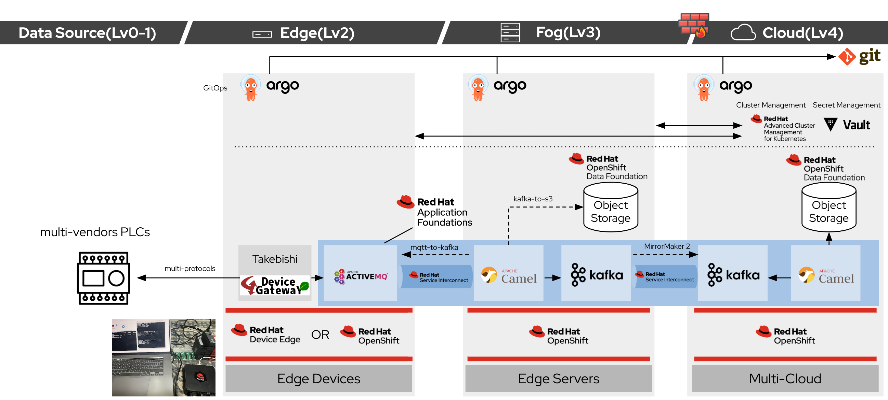

# multicloud-gitops-with-takebishi

Large scale deployment Takebishi Device Gateway on OpenShift with GitOps approach

[](https://opensource.org/licenses/Apache-2.0)

[Live build status](https://util.hybrid-cloud-patterns.io/dashboard.php?pattern=mcgitops)

## Architecture



## Getting Started

If you've followed a link to this repository, but are not really sure what it contains
or how to use it, head over to [Multicloud GitOps](http://hybrid-cloud-patterns.io/multicloud-gitops/)
for additional context and installation instructions

i) Fork this Git repository to your Git account.

ii) copy a `values-secret.yaml` to any path and edit your own configuration

```bash
cp values-secret.yaml.template ~/values-secret.yaml
vi ~/values-secret.yaml
```

iii) modify `value-hub.yaml` file
Change `clusterGroup.managedClusterGroups.clusterPools.baseDomain` to the appropriate value.

iv) run `pattern.sh` as follows:

```bash
./pattern.sh make install
```

Once you run `pattern.sh`, a `pattern` operator is installed onto your OpenShift Cluster.
A `pattern` operator is configured as using your Git repo path.

> If you are using MAC OS, you need to install podman-desktop.

## Demo

[Under Construction]

- If you deploy this pattern to a public cloud, ZTP of clusters, apps, and interconnect between clusters(using skupper) are performed.
- Once import your own cluster as edge or fog cluster to ACM, required apps are deloyed by ArgoCD automatically.

- You can check Device Gateway data in `demo` bucket on ODF as the following command:

```bash
ACCESS_KEY=xxx
SECRET_KEY=xxx
S3_ENDPOINT=$(oc get route s3-rgw -n openshift-storage -ojsonpath='{.status.ingress[*].host}')
alias s3='AWS_ACCESS_KEY_ID=$ACCESS_KEY AWS_SECRET_ACCESS_KEY=$SECRET_KEY aws --endpoint $S3_ENDPOINT --no-verify-ssl s3'
```

```bash
s3 ls
s3 ls s3://demo
s3 cp s3://demo/ /path/ --recursive
```

## Installed Operators

### Hub Cluster

- OpenShift GitOps
- Red Hat Advanced Cluster Management for K8s
- Red Hat Service Interconnect
- Red Hat Data Foundation
- Red Hat AMQ Streams Operator
- Red Hat Integration

### Fog Cluster

- OpenShift GitOps
- Red Hat Service Interconnect
- Red Hat Data Foundation
- Red Hat AMQ Streams Operator
- Red Hat Integration

### Edge Cluster

- OpenShift GitOps
- Red Hat Service Interconnect
- Red Hat AMQ