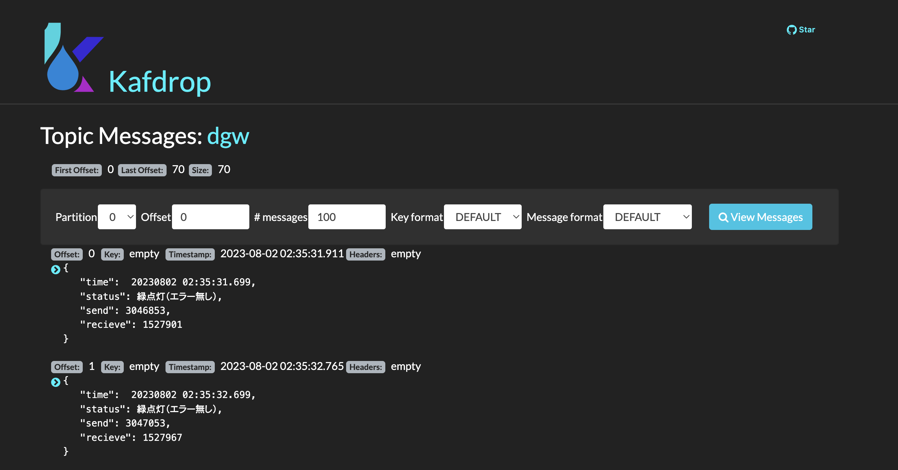

# multicloud-gitops-with-takebishi

Large scale deployment Takebishi Device Gateway on OpenShift with GitOps approach

[](https://opensource.org/licenses/Apache-2.0)

[Live build status](https://util.hybrid-cloud-patterns.io/dashboard.php?pattern=mcgitops)


## Getting Started

If you've followed a link to this repository, but are not really sure what it contains
or how to use it, head over to [Multicloud GitOps](http://hybrid-cloud-patterns.io/multicloud-gitops/)
for additional context and installation instructions

i) Fork this Git repository to your Git account.

ii) copy a `values-secret.yaml` to any path and edit your own configuration

```bash
cp values-secret.yaml.template ~/values-secret.yaml
vi ~/values-secret.yaml
```

iii) modify `value-hub.yaml` file
Change `clusterGroup.managedClusterGroups.clusterPools.baseDomain` to the appropriate value.

iv) run `pattern.sh` as follows:

```bash
./pattern.sh make install
```

Once you run `pattern.sh`, a `pattern` operator is installed onto your OpenShift Cluster.
A `pattern` operator is configured as using your Git repo path.

> If you are using MAC OS, you need to install podman-desktop.

## EdgeとFogの接続

### [Fog side] Skupper Tokenを作成
```bash
oc login --server https://api.fog-fog-$CLUSTERID.$BASEDOMAIN:6443 -u kubeadmin -p $PASSWORD
oc project kafka
skupper token create ~/token.yaml
```

### [Edge side] Skupper Linkの作成
```bash
oc login --server https://api.edge-edge-$CLUSTERID.$BASEDOMAIN:6443 -u kubeadmin -p $PASSWORD
oc project mqtt
skupper link create ~/token.yaml
skupper link status
```

```
Links created from this site:

         Link link1 is connected
```

### [Edge side] MQTT BrokerをFogへExpose

```bash
skupper expose statefulset amq-broker-ss --headless --target-port 61616
skupper service status
```

```
Services exposed through Skupper:
╰─ amq-broker-hdls-svc (tcp ports 8161 61616)
   ╰─ Targets:
      ╰─ ActiveMQArtemis=amq-broker,application=amq-broker-app name=amq-broker-ss namespace=mqtt
```

### [Fog side] 接続確認



## HubとFogの接続

### [Hub side] Skupper Tokenを作成

```bash
oc login --server https://api.$CLUSTERNAME.$BASEDOMAIN:6443 -u kubeadmin -p $PASSWORD
oc project kafka
skupper token create ~/token.yaml
```

### [Fog side] Skupper Linkの作成
```bash
oc login --server https://api.edge-edge-$CLUSTERID.$BASEDOMAIN:6443 -u kubeadmin -p $PASSWORD
oc project mqtt
skupper link create ~/token.yaml
skupper link status
```

```
Links created from this site:

         Link link1 is connected
```

### [Edge side] MQTT BrokerをFogへExpose

```bash
skupper expose statefulset amq-broker-ss --headless --target-port 61616
skupper service status
```

```
Services exposed through Skupper:
╰─ amq-broker-hdls-svc (tcp ports 8161 61616)
   ╰─ Targets:
      ╰─ ActiveMQArtemis=amq-broker,application=amq-broker-app name=amq-broker-ss namespace=mqtt
```

## Connection between hub and edge cluster

You can connect Kafka cluster in between hub and edge by usin Skupper.
Run the following command:

i) skupper token create in `hub cluster``

```bash
oc login https://HUBCLUSTER:6443
skupper token create ~/token.yaml
```

ii) skupper link create in `edge cluster

```bash
oc login https://EDGECLUSTER:6443
skupper link create ~/token.yaml
```

iii) expose kafka address from hub cluster to edge cluster

```bash
skupper expose service hub-cluster-kafka-bootstrap --address hub-cluster-kafka-bootstrap
```

### From Hub to Fog

```bash
skupper expose service hub-cluster-kafka-bootstrap --address hub-cluster-kafka-bootstrap
```

```bash
vi ~/.odf/credentials
```

```bash
./pattern.sh make load-secrets
```